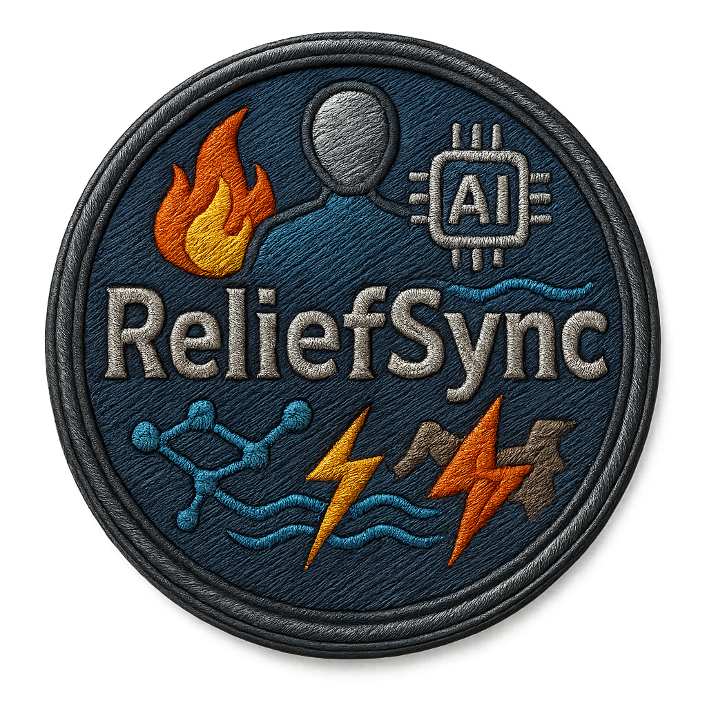

<p align="center">
  
</p>

<h1 align="center">🌍 ReliefSync</h1>

<p align="center">
  <strong>A Comprehensive Disaster Relief Management Platform</strong>
</p>

<p align="center">
  <em>Connecting Citizens, NGOs, Government Agencies & Relief Agents during Emergency Situations</em>
</p>

<p align="center">
  
  
  
</p>

---

## 📋 Table of Contents

- [About The Project](#-about-the-project)
- [Key Features](#-key-features)
- [Tech Stack](#-tech-stack)
- [Project Structure](#-project-structure)
- [Getting Started](#-getting-started)
- [Environment Setup](#-environment-setup)
- [Running the Application](#-running-the-application)
- [API Documentation](#-api-documentation)
- [User Roles](#-user-roles)
- [Screenshots](#-screenshots)
- [Contributing](#-contributing)
- [License](#-license)

---

## 🎯 About The Project

ReliefSync is a full-stack disaster relief management platform designed to streamline emergency response coordination. The platform bridges the gap between affected citizens, relief organizations (NGOs), government agencies, and field agents to ensure efficient disaster management and resource distribution.

### 🌟 What Makes ReliefSync Special?

- **Real-time Coordination** - Live updates and communication between all stakeholders
- **AI-Powered Analysis** - OpenAI integration for intelligent disaster assessment
- **Satellite Integration** - Google Earth Engine for flood detection and area analysis
- **Blockchain Ready** - Web3 wallet integration for transparent resource tracking
- **Multi-Role Dashboard** - Customized interfaces for different user types
- **Geospatial Intelligence** - Interactive maps with heat visualization

---

## ✨ Key Features

### 🆘 Disaster Reporting & Monitoring
- Real-time disaster reporting with geolocation
- Severity classification and risk assessment
- Interactive map visualization with heat layers
- Historical disaster data analysis

### 🤝 Relief Coordination
- Task allocation between NGOs and field agents
- Resource tracking with QR code verification
- Delivery confirmation and feedback system
- Real-time status updates via Socket.IO

### 📢 Emergency Communication
- Voice mail for urgent communications
- Push notifications via OneSignal
- Email alerts and notifications
- Real-time chat and updates

### 💰 Resource Management
- QR code-based resource tracking
- Digital payment integration (Razorpay)
- Blockchain wallet connectivity
- Transparent allocation system

### 🗺️ Geospatial Features
- Interactive Leaflet maps
- Heat map visualization
- Distance calculation
- Area boundary detection

### 🤖 AI & ML Integration
- OpenAI for text analysis and categorization
- Google Earth Engine for satellite imagery
- Weather prediction and forecasting
- Flood detection and early warning

---

## 🛠 Tech Stack

### Frontend Technologies

<table>
  <tr>
    <td align="center" width="96">
      
      <br>React 19.1.0
    </td>
    <td align="center" width="96">
      
      <br>Vite 6.3.5
    </td>
    <td align="center" width="96">
      
      <br>Tailwind 4.1.14
    </td>
    <td align="center" width="96">
      
      <br>Redux Toolkit
    </td>
  </tr>
</table>

#### Complete Frontend Stack

| Category | Technology | Version |
|----------|------------|---------|
| **Core** | React | 19.1.0 |
| | Vite | 6.3.5 |
| | React Router DOM | 7.6.0 |
| **Styling** | TailwindCSS | 4.1.14 |
| | HeroUI | 2.8.0-beta.6 |
| | Framer Motion | 12.15.0 |
| | GSAP | 3.13.0 |
| **State** | Redux Toolkit | 2.8.2 |
| | Redux Persist | 6.0.0 |
| | TanStack Query | 5.84.1 |
| **Maps** | Leaflet | 1.9.4 |
| | React Leaflet | 5.0.0 |
| | Turf.js | 7.2.0 |
| **Web3** | RainbowKit | 2.2.8 |
| | Wagmi | 2.16.1 |
| | Viem | 2.33.2 |
| **Forms** | React Hook Form | 7.56.4 |
| | Zod | 3.25.46 |
| **Real-time** | Socket.IO Client | 4.8.1 |
| | OneSignal | 3.2.3 |
| **HTTP** | Axios | 1.13.2 |
| **Utils** | JWT Decode | 4.0.0 |
| | HTML5 QRCode | 2.3.8 |
| | DOMPurify | 3.2.7 |

### Backend Technologies

<table>
  <tr>
    <td align="center" width="96">
      
      <br>Node.js 18+
    </td>
    <td align="center" width="96">
      
      <br>Express 5.1.0
    </td>
    <td align="center" width="96">
      
      <br>MongoDB
    </td>
    <td align="center" width="96">
      
      <br>Socket.IO
    </td>
  </tr>
</table>

#### Complete Backend Stack

| Category | Technology | Version |
|----------|------------|---------|
| **Core** | Node.js | 18+ |
| | Express | 5.1.0 |
| **Database** | MongoDB | 6.16.0 |
| | Mongoose | 8.15.0 |
| **Auth** | JWT | 9.0.2 |
| | bcrypt | 6.0.0 |
| | Google Auth | 10.0.0 |
| **Security** | Helmet | 8.1.0 |
| | CORS | 2.8.5 |
| | Rate Limit | 7.5.0 |
| | Mongo Sanitize | 2.2.0 |
| **Real-time** | Socket.IO | 4.8.1 |
| **AI/ML** | OpenAI | 6.6.0 |
| | Earth Engine | 1.5.24 |
| **Files** | Cloudinary | 2.7.0 |
| | Multer | 1.4.5 |
| | FFmpeg | 5.3.0 |
| **Payment** | Razorpay | 2.9.6 |
| **Geo** | H3-js | 4.2.1 |
| **Utils** | Axios | 1.13.2 |
| | QRCode | 1.5.4 |
| | Cron | 4.3.3 |
| | UUID | 13.0.0 |

---

## 📁 Project Structure

```
ReliefSync/
│
├── 📄 README.md                        # Project documentation (this file)
├── 📄 LICENSE                          # Project license
│
├── 📁 Client/                          # Frontend React Application
│   │
│   ├── 📁 public/                      # Static public assets
│   │   ├── OneSignalSDKWorker.js      # Push notification service worker
│   │   └── vite.svg                   # Vite logo
│   │
│   ├── 📁 src/                         # Source code
│   │   │
│   │   ├── 📁 assets/                  # Static assets
│   │   │   ├── Android.mp4            # Android demo video
│   │   │   ├── Auth_back.png          # Auth background image
│   │   │   ├── desktop.mp4            # Desktop demo video
│   │   │   └── Logo.png               # Application logo
│   │   │
│   │   ├── 📁 auth/                    # Authentication components
│   │   │   ├── EyeIcon.jsx            # Password visibility toggle
│   │   │   ├── ForgotPassword.jsx     # Password recovery
│   │   │   ├── GoogleAuth.jsx         # Google OAuth
│   │   │   ├── GOV_Verification.jsx   # Government verification
│   │   │   ├── Login.jsx              # Login form
│   │   │   ├── NGO_Verification.jsx   # NGO verification
│   │   │   ├── ResetPassword.jsx      # Password reset
│   │   │   ├── Signup.jsx             # Registration form
│   │   │   └── VerifyEmail.jsx        # Email verification
│   │   │
│   │   ├── 📁 components/              # Reusable UI components
│   │   │   │
│   │   │   ├── 📁 Admin/               # Admin dashboard components
│   │   │   │   ├── ActiveAllocation.jsx
│   │   │   │   ├── AgentCards.jsx
│   │   │   │   ├── AgentStatus.jsx
│   │   │   │   ├── AgentStatusCard.jsx
│   │   │   │   ├── AgentVerification.jsx
│   │   │   │   ├── Home.jsx
│   │   │   │   ├── NgoCards.jsx
│   │   │   │   ├── NGOStatus.jsx
│   │   │   │   ├── NGOStatusCard.jsx
│   │   │   │   └── NGOVerification.jsx
│   │   │   │
│   │   │   ├── 📁 Citizen/             # Citizen components
│   │   │   │   ├── HelpDesk.jsx
│   │   │   │   ├── Home.jsx
│   │   │   │   └── TodayArea.jsx
│   │   │   │
│   │   │   ├── 📁 Common_Features/     # Shared components
│   │   │   │   ├── AllocatedTask.jsx
│   │   │   │   ├── DeliveredTable.jsx
│   │   │   │   ├── DisasterReport.jsx
│   │   │   │   ├── EventTable.jsx
│   │   │   │   ├── FeedBack.jsx
│   │   │   │   ├── FeedBackCard.jsx
│   │   │   │   ├── FilterRequest.jsx
│   │   │   │   ├── Footer.jsx
│   │   │   │   ├── HelpRequest.jsx
│   │   │   │   ├── HomeSetup.jsx
│   │   │   │   ├── LeftDrawer.jsx
│   │   │   │   ├── Map.jsx
│   │   │   │   ├── Navbar.jsx
│   │   │   │   ├── NoData.jsx
│   │   │   │   ├── ScanQr.jsx
│   │   │   │   ├── Sidebar.jsx
│   │   │   │   ├── TargetAllocation.jsx
│   │   │   │   ├── ToggleHelp.jsx
│   │   │   │   ├── UrgentVoiceMail.jsx
│   │   │   │   ├── UserAvatar.jsx
│   │   │   │   ├── UserProfile.jsx
│   │   │   │   ├── WalletConnect.jsx
│   │   │   │   └── WalletProvider.jsx
│   │   │   │
│   │   │   ├── 📁 Gov_Agency/          # Government agency components
│   │   │   │   ├── AgentWaitlist.jsx
│   │   │   │   └── Home.jsx
│   │   │   │
│   │   │   ├── 📁 Helper/              # Utility components
│   │   │   │   ├── CalculateDistance.jsx
│   │   │   │   ├── ConnectSocket.jsx
│   │   │   │   ├── CountryCenter.jsx
│   │   │   │   ├── GeoLocation.jsx
│   │   │   │   ├── HeatMapLayer.jsx
│   │   │   │   ├── MapEffect.js
│   │   │   │   ├── MobileDragControl.jsx
│   │   │   │   ├── SearchBar.jsx
│   │   │   │   ├── TextFormatter.jsx
│   │   │   │   │
│   │   │   │   └── 📁 Modals/          # Modal components
│   │   │   │       ├── DisasterRiskModal.jsx
│   │   │   │       ├── FeedbackModel.jsx
│   │   │   │       ├── NotificationModal.jsx
│   │   │   │       │
│   │   │   │       └── 📁 Finance/     # Payment modals
│   │   │   │           ├── CurrencyTransfer.jsx
│   │   │   │           ├── DigitalTransfer.jsx
│   │   │   │           └── PaymentModal.jsx
│   │   │   │
│   │   │   ├── 📁 NGO/                 # NGO components
│   │   │   │   ├── Home.jsx
│   │   │   │   ├── NgoWaitlist.jsx
│   │   │   │   └── TodayTask.jsx
│   │   │   │
│   │   │   ├── 📁 ui/                  # Base UI components
│   │   │   │   ├── BoxEffect.jsx
│   │   │   │   ├── DraggableCard.jsx
│   │   │   │   ├── FooterEffect.jsx
│   │   │   │   ├── form.jsx
│   │   │   │   ├── input-otp.jsx
│   │   │   │   ├── label.jsx
│   │   │   │   ├── SmallCardEffect.jsx
│   │   │   │   ├── TextHoverEffect.jsx
│   │   │   │   │
│   │   │   │   └── 📁 shadcn-io/
│   │   │   │       └── 📁 3d-marquee/
│   │   │   │           └── index.jsx
│   │   │   │
│   │   │   ├── AreaToday.jsx
│   │   │   ├── DisasterRiskOverview.jsx
│   │   │   ├── Disaster_DraggableCard.jsx
│   │   │   ├── Disaster_small.jsx
│   │   │   └── Waitlist.jsx
│   │   │
│   │   ├── 📁 ConnectContract/         # Web3/Blockchain
│   │   │   ├── AidABI.json
│   │   │   ├── ConnectionAddress.js
│   │   │   ├── ForeCastABI.json
│   │   │   └── Web3Connection.jsx
│   │   │
│   │   ├── 📁 layouts/                 # Layout components
│   │   │
│   │   ├── 📁 lib/                     # Library utilities
│   │   │   └── utils.js
│   │   │
│   │   ├── 📁 OneSignalSetup/          # Push notifications
│   │   │   └── OneSignalProvider.jsx
│   │   │
│   │   ├── 📁 pages/                   # Page components
│   │   │   │
│   │   │   ├── 📁 AdminPages/
│   │   │   │   ├── ActiveAllocationPage.jsx
│   │   │   │   ├── AdminHomePage.jsx
│   │   │   │   ├── AgentStatusPage.jsx
│   │   │   │   ├── AgentVerificationPage.jsx
│   │   │   │   ├── NGOStatusPage.jsx
│   │   │   │   └── NGOVerificationPage.jsx
│   │   │   │
│   │   │   ├── 📁 AuthPages/
│   │   │   │   ├── AgentWaitlistPage.jsx
│   │   │   │   ├── DashboardPage.jsx
│   │   │   │   └── NgoWaitlistPage.jsx
│   │   │   │
│   │   │   ├── 📁 CitizenPages/
│   │   │   │   ├── CitizenHomePage.jsx
│   │   │   │   └── HelpDeskPage.jsx
│   │   │   │
│   │   │   ├── 📁 CommonPages/
│   │   │   │   ├── AllocatedTaskPage.jsx
│   │   │   │   ├── DeliveredPage.jsx
│   │   │   │   ├── DisasterReportPage.jsx
│   │   │   │   ├── EventTablePage.jsx
│   │   │   │   ├── HelpRequestPage.jsx
│   │   │   │   ├── UrgentVoiceMailPage.jsx
│   │   │   │   └── UserProfilePage.jsx
│   │   │   │
│   │   │   ├── 📁 Gov_AgencyPages/
│   │   │   │   └── AgentHomePage.jsx
│   │   │   │
│   │   │   └── 📁 NGOPages/
│   │   │       └── NGOHomePage.jsx
│   │   │
│   │   ├── 📁 routes/                  # React Router config
│   │   │
│   │   ├── 📁 store/                   # Redux store
│   │   │   ├── index.js
│   │   │   ├── rootReducer.js
│   │   │   │
│   │   │   └── 📁 slices/
│   │   │       ├── authSlice.jsx
│   │   │       ├── disasterSlice.jsx
│   │   │       └── userSlice.jsx
│   │   │
│   │   ├── 📁 utils/                   # Utility functions
│   │   │   └── axios.js
│   │   │
│   │   ├── App.jsx                    # Root component
│   │   ├── index.css                  # Global styles
│   │   ├── main.jsx                   # Entry point
│   │   └── rainbowKitConfig.jsx       # Web3 config
│   │
│   ├── .env                           # Environment variables
│   ├── .gitignore
│   ├── components.json
│   ├── eslint.config.js
│   ├── index.html
│   ├── jsconfig.json
│   ├── package.json
│   ├── postcss.config.mjs
│   ├── tailwind.config.js
│   ├── vercel.json
│   └── vite.config.js
│
└── 📁 Server/                          # Backend Node.js Application
    │
    ├── 📁 config/                      # Configuration files
    │   └── reliefsync-service-account.json
    │
    ├── 📁 src/                         # Source code
    │   │
    │   ├── 📁 controllers/             # Route handlers
    │   │   ├── admin.controller.js
    │   │   ├── agent.controller.js
    │   │   ├── auth.controller.js
    │   │   ├── disasterReport.controller.js
    │   │   ├── ngo.controller.js
    │   │   ├── notification.controller.js
    │   │   ├── QrCode.controller.js
    │   │   ├── razorpay.controller.js
    │   │   ├── user.controller.js
    │   │   └── weatherCheck.controller.js
    │   │
    │   ├── 📁 db/                      # Database config
    │   │   └── index.js
    │   │
    │   ├── 📁 Helper/                  # Helper functions
    │   │   ├── audioConverter.js      # FFmpeg audio conversion
    │   │   ├── disasterAPIs.js        # External disaster APIs
    │   │   ├── fetchFloodReport.js    # Flood data fetching
    │   │   ├── generateTiles.js       # Map tile generation
    │   │   └── uploadPinata.js        # IPFS upload
    │   │
    │   ├── 📁 middleware/              # Express middleware
    │   │   ├── authMiddleware.js      # JWT authentication
    │   │   └── multer.js              # File upload config
    │   │
    │   ├── 📁 models/                  # Mongoose schemas
    │   │   ├── agent.model.js
    │   │   ├── areaDisaster.model.js
    │   │   ├── auth.model.js
    │   │   ├── coordinates.model.js
    │   │   ├── emergency.model.js
    │   │   ├── feedback.model.js
    │   │   ├── ngo.model.js
    │   │   ├── predictionData.model.js
    │   │   ├── qrcode.model.js
    │   │   └── tokenBlackList.model.js
    │   │
    │   ├── 📁 routes/                  # API routes
    │   │   ├── admin.route.js
    │   │   ├── agent.route.js
    │   │   ├── auth.route.js
    │   │   ├── disasterReport.route.js
    │   │   ├── index.route.js
    │   │   ├── ngo.route.js
    │   │   ├── notification.route.js
    │   │   ├── qrCode.route.js
    │   │   ├── razorpay.route.js
    │   │   ├── user.route.js
    │   │   └── weatherCheck.route.js
    │   │
    │   ├── 📁 Templates/               # Email templates
    │   │   └── 📁 Mail/
    │   │
    │   ├── 📁 utils/                   # Utility functions
    │   │   ├── catchAsync.js
    │   │   └── filterObj.js
    │   │
    │   ├── app.js                     # Express app config
    │   └── index.js                   # Server entry point
    │
    ├── .env                           # Environment variables
    ├── .gitignore
    ├── IndiaData.js                   # India geographic data
    └── package.json
```

---

## 🚀 Getting Started

### Prerequisites

Before you begin, ensure you have the following installed:

| Requirement | Version | Download |
|-------------|---------|----------|
| Node.js | 18.0.0+ | [nodejs.org](https://nodejs.org/) |
| npm | 9.0.0+ | Comes with Node.js |
| MongoDB | 6.0+ | [mongodb.com](https://www.mongodb.com/try/download/community) |
| Git | Latest | [git-scm.com](https://git-scm.com/) |
| FFmpeg | Latest | [ffmpeg.org](https://ffmpeg.org/download.html) |

### Installation

#### 1. Clone the Repository

```bash
git clone https://github.com/yourusername/ReliefSync.git
cd ReliefSync
```

#### 2. Install Client Dependencies

```bash
cd Client
npm install
```

#### 3. Install Server Dependencies

```bash
cd ../Server
npm install
```

---

## ⚙️ Environment Setup

### Client Environment Variables

Create a `.env` file in the `Client/` directory:

```env
# API Configuration
VITE_API_URL=http://localhost:5000/api
VITE_SOCKET_URL=http://localhost:5000

# OneSignal Push Notifications
VITE_ONESIGNAL_APP_ID=your_onesignal_app_id

# Google OAuth
VITE_GOOGLE_CLIENT_ID=your_google_client_id

# Web3/Blockchain
VITE_WALLET_CONNECT_PROJECT_ID=your_walletconnect_project_id

# Map Configuration
VITE_MAP_API_KEY=your_map_api_key
```

### Server Environment Variables

Create a `.env` file in the `Server/` directory:

```env
# Server Configuration
PORT=5000
SERVER_URL=http://localhost:5000
FRONTEND_URL=http://localhost:5173
NODE_ENV=development

# Database
MONGODB_URI=mongodb://localhost:27017/reliefsync

# JWT Authentication
JWT_SECRET=your_super_secret_jwt_key_here
JWT_EXPIRES_IN=7d

# Cloudinary (File Storage)
CLOUDINARY_CLOUD_NAME=your_cloud_name
CLOUDINARY_API_KEY=your_api_key
CLOUDINARY_API_SECRET=your_api_secret

# Razorpay (Payments)
RAZORPAY_KEY_ID=your_razorpay_key_id
RAZORPAY_KEY_SECRET=your_razorpay_key_secret

# OpenAI (AI Features)
OPENAI_API_KEY=your_openai_api_key

# Google Services
GOOGLE_CLIENT_ID=your_google_client_id
GOOGLE_CLIENT_SECRET=your_google_client_secret

# Email Configuration
EMAIL_HOST=smtp.gmail.com
EMAIL_PORT=587
EMAIL_USER=your_email@gmail.com
EMAIL_PASS=your_app_password

# OneSignal (Push Notifications)
ONESIGNAL_APP_ID=your_onesignal_app_id
ONESIGNAL_API_KEY=your_onesignal_api_key
```

---

## ▶️ Running the Application

### Development Mode

#### Terminal 1 - Start the Server

```bash
cd Server
npm run dev
```

Server will start at: `http://localhost:5000`

#### Terminal 2 - Start the Client

```bash
cd Client
npm run dev
```

Client will start at: `http://localhost:5173`

### Production Mode

#### Build Client

```bash
cd Client
npm run build
npm run preview
```

#### Start Server

```bash
cd Server
npm start
```

### Quick Start Commands

| Location | Command | Description |
|----------|---------|-------------|
| `Client/` | `npm run dev` | Start development server |
| `Client/` | `npm run build` | Build for production |
| `Client/` | `npm run preview` | Preview production build |
| `Client/` | `npm run lint` | Run ESLint |
| `Server/` | `npm run dev` | Start with nodemon (auto-reload) |
| `Server/` | `npm start` | Start production server |

---

## 📡 API Documentation

### Base URL
```
http://localhost:5000/api
```

### Authentication Endpoints

| Method | Endpoint | Description |
|--------|----------|-------------|
| POST | `/auth/register` | Register new user |
| POST | `/auth/login` | User login |
| POST | `/auth/logout` | User logout |
| POST | `/auth/verify-email` | Verify email with OTP |
| POST | `/auth/forgot-password` | Request password reset |
| POST | `/auth/reset-password` | Reset password |
| POST | `/auth/google` | Google OAuth login |

### User Endpoints

| Method | Endpoint | Description |
|--------|----------|-------------|
| GET | `/user/profile` | Get user profile |
| PATCH | `/user/profile` | Update profile |
| GET | `/user/dashboard` | Get dashboard data |

### Disaster Endpoints

| Method | Endpoint | Description |
|--------|----------|-------------|
| POST | `/disaster/report` | Submit disaster report |
| GET | `/disaster/reports` | Get all reports |
| GET | `/disaster/reports/:id` | Get specific report |
| GET | `/disaster/nearby` | Get nearby disasters |
| GET | `/disaster/area/:areaId` | Get area disasters |

### NGO Endpoints

| Method | Endpoint | Description |
|--------|----------|-------------|
| GET | `/ngo/tasks` | Get assigned tasks |
| POST | `/ngo/delivery` | Mark delivery complete |
| GET | `/ngo/statistics` | Get NGO statistics |
| POST | `/ngo/feedback` | Submit feedback |

### Admin Endpoints

| Method | Endpoint | Description |
|--------|----------|-------------|
| GET | `/admin/users` | List all users |
| POST | `/admin/verify-ngo` | Verify NGO |
| POST | `/admin/verify-agent` | Verify agent |
| GET | `/admin/analytics` | Platform analytics |
| POST | `/admin/allocate` | Allocate resources |

### Payment Endpoints

| Method | Endpoint | Description |
|--------|----------|-------------|
| POST | `/payment/create-order` | Create payment order |
| POST | `/payment/verify` | Verify payment |
| GET | `/payment/history` | Payment history |

### Weather Endpoints

| Method | Endpoint | Description |
|--------|----------|-------------|
| GET | `/weather/current` | Current weather |
| GET | `/weather/forecast` | Weather forecast |
| GET | `/weather/alerts` | Weather alerts |

---

## 👥 User Roles

### 🧑‍💼 Citizen
- Report disasters and emergencies
- Request help and assistance
- View affected areas on map
- Track relief status
- Provide feedback

### 🏢 NGO (Non-Governmental Organization)
- Receive and manage relief tasks
- Coordinate resource distribution
- Track deliveries with QR codes
- View assigned areas
- Submit delivery reports

### 🏛️ Government Agency
- Oversee relief operations
- Manage field agents
- Verify organizations
- Access analytics dashboard
- Coordinate with NGOs

### 👨‍💻 Administrator
- Full system access
- User verification
- Resource allocation
- Platform analytics
- System configuration

---

## 🖼️ Screenshots

<details>
<summary>Click to view screenshots</summary>

### Landing Page
> *Add screenshot here*

### Citizen Dashboard
> *Add screenshot here*

### NGO Dashboard
> *Add screenshot here*

### Admin Panel
> *Add screenshot here*

### Disaster Map
> *Add screenshot here*

</details>

---

## 🤝 Contributing

Contributions are welcome! Please follow these steps:

1. **Fork the repository**
2. **Create a feature branch**
   ```bash
   git checkout -b feature/AmazingFeature
   ```
3. **Commit your changes**
   ```bash
   git commit -m 'Add some AmazingFeature'
   ```
4. **Push to the branch**
   ```bash
   git push origin feature/AmazingFeature
   ```
5. **Open a Pull Request**

### Code Style Guidelines

- Use ESLint for code linting
- Follow React best practices
- Write meaningful commit messages
- Add comments for complex logic
- Update documentation as needed

---

## 📄 License

This project is licensed under the ISC License - see the [LICENSE](LICENSE) file for details.

---

## 🙏 Acknowledgments

- [React](https://reactjs.org/) - UI Library
- [Express](https://expressjs.com/) - Web Framework
- [MongoDB](https://www.mongodb.com/) - Database
- [Socket.IO](https://socket.io/) - Real-time Communication
- [OpenAI](https://openai.com/) - AI Integration
- [Google Earth Engine](https://earthengine.google.com/) - Satellite Data
- [Leaflet](https://leafletjs.com/) - Interactive Maps
- [TailwindCSS](https://tailwindcss.com/) - Styling
- [RainbowKit](https://www.rainbowkit.com/) - Web3 Integration

---

<p align="center">
  <strong>Made with 💙 for Disaster Relief Coordination</strong>
</p>

<p align="center">
  <a href="#-reliefsync">Back to Top ⬆️</a>
</p>
